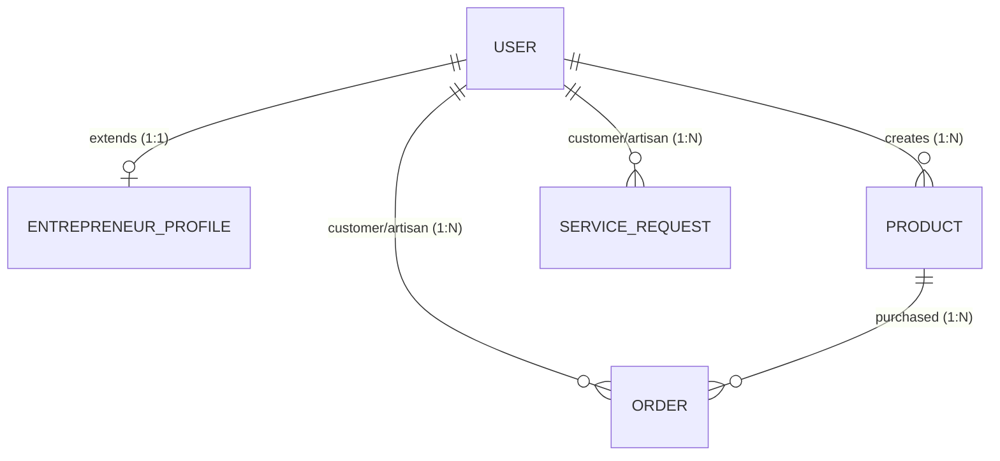

# Detailed Project Report (DPR)
## HunarHub – Digital Marketplace for Local Micro-Entrepreneurs

---

## 1. Executive Summary

Millions of local micro-entrepreneurs, including cobblers, potters (kumhar), tailors, weavers, and small street vendors, possess unique traditional skills and produce high-quality handmade products. However, they are virtually invisible in the modern digital economy. Most rely strictly on foot traffic, word-of-mouth recommendations, or predatory middlemen, severely limiting their income growth and business sustainability.

**HunarHub** is a web-based digital marketplace that bridges this divide. It provides a unified, responsive platform where local micro-entrepreneurs can showcase their skills, take custom service bookings, and sell handmade goods directly to local consumers. By offering simple, mobile-friendly digital tools, the platform promotes digital inclusion, boosts household income for small creators, and supports sustainable local commerce.

---

## 2. Problem Statement & Context

### 2.1 Current Challenges faced by Micro-Entrepreneurs
*   **Zero Digital Footprint:** Lack of technical knowledge and high costs associated with website development keep local vendors invisible to the digital-first customer base.
*   **Dependency on Intermediaries:** Traditional artisans often sell products to middlemen at thin margins, who then resell them at high markups in urban markets.
*   **Lack of Structure for Custom Bookings:** Offline service requests are chaotic, with no fixed record of details, dates, pricing, or availability.
*   **Volatile Pricing & Low Trust:** Customers face pricing ambiguity, while artisans struggle to assert value for their manual labour and premium materials.

### 2.2 Objectives
#### Primary Objectives:
*   Connect local micro-entrepreneurs directly with customers in their vicinity.
*   Enable service bookings (custom labor) and product selling (physical merchandise) under one storefront.
*   Promote traditional skills, handloom crafts, and handmade items.
*   Maximize direct income and reduce economic vulnerability for small vendors.

#### Secondary Objectives:
*   Foster eco-friendly, carbon-efficient hyper-local shipping.
*   Equip digital novices with an intuitive, simplified workspace dashboard.
*   Establish community trust through dynamic, transparent reviews and verification badges.

---

## 3. System Scope & Boundaries

```
┌────────────────────────────────────────────────────────────────────────┐
│                              HUNARHUB SCOPE                            │
├───────────────────────────────────────┬────────────────────────────────┤
│               IN-SCOPE                │          OUT-OF-SCOPE          │
├───────────────────────────────────────┼────────────────────────────────┤
│ • Responsive web-app (mobile-first)   │ • Native mobile applications   │
│ • Unified Service & Shop profiles     │ • International logistics      │
│ • Custom service booking workflows    │ • Advanced AI recommendation   │
│ • Product catalog with stock control  │ • Integrated delivery tracking │
│ • Admin verification & metrics panels │ • Payment gateway gateways     │
└───────────────────────────────────────┴────────────────────────────────┘
```

---

## 4. Functional Specification

The application features three main roles: Customers, Micro-Entrepreneurs, and Administrators.

### 4.1 Customer Module
*   **Profile Management:** User registration, secure login, and session persistence.
*   **Search Engine:** Text filtering across business names and skills tags, combined with geolocation neighborhood matches (e.g. "Ameerpet", "Kukatpally").
*   **Category Filter:** Filter by primary categories: Potter, Cobbler, Tailor, Artisan, Small Vendor.
*   **Service Bookings:** Place a request to an entrepreneur specifying the target date, description of work, and suggested price budget.
*   **Handcrafted Shop:** Browse physical goods listed by the artisan and purchase items, triggering immediate inventory stock checking and deduction.
*   **Ratings & Feedback:** Rate completed services and delivered orders. Reviews are averaged and dynamically aggregated to compute the seller's score.

### 4.2 Entrepreneur Module
*   **Profile Customizer:** Setup biography, upload contact details (number, email, location), years of experience, and custom pricing charts.
*   **Availability Controller:** Toggle active status. If marked "Busy", service booking forms are locked for customers.
*   **Service Requests Manager:** Accept or reject incoming service requests. Once finished, mark them "Completed" to transfer proposed budgets to cumulative earnings.
*   **Product Storefront Manager:** Full CRUD interface to list products (name, description, price, stock, category tags).
*   **Earnings Panel:** View total revenue generated dynamically on the platform.

### 4.3 Administrator Module
*   **Verification Manager:** Access a grid of all registered creators and approve/revoke verified status badges based on offline credentials.
*   **Platform Dashboard:** Real-time platform KPIs, including total registered users, active transaction volume (sales + bookings), service request completion rates, and categorical breakdown.

---

## 5. Technical Architecture & Database Design

The project is built on the **MERN Stack** (MongoDB, Express, React, Node.js) with the following database schema mapping:



### 5.1 Schema Fields Definition (Mongoose)

1.  **User:** Contains email (unique index), hashed password, name, phone, and geographic location.
2.  **EntrepreneurProfile:** Links to a User ID. Stores business details, category, list of skills tags, years of experience, verification status, active availability flag, aggregate ratings (`average` and `count`), and cumulative `earnings`.
3.  **Product:** Tracks parent entrepreneur user ID, item name, description, category, unit price, stock quantity, and optional image links.
4.  **ServiceRequest:** Tracks customer and entrepreneur user IDs, service description, target proposed date, proposed price budget, current status (`pending`, `accepted`, `rejected`, `completed`, `cancelled`), customer note, and feedback (rating + comments).
5.  **Order:** Connects product ID, buyer, seller, quantity ordered, total price, shipping address, status (`pending`, `shipped`, `delivered`, `cancelled`), and feedback reviews.

---

## 6. REST API Endpoints Catalog

| Context | Method | Endpoint | Authorization | Description |
| :--- | :--- | :--- | :--- | :--- |
| **Auth** | `POST` | `/api/auth/register` | Public | Registers customer/entrepreneur accounts. |
| **Auth** | `POST` | `/api/auth/login` | Public | Authenticates and returns JWT token. |
| **Auth** | `GET` | `/api/auth/me` | User Session | Validates token and returns current user details. |
| **Profiles** | `GET` | `/api/profiles` | Public | Lists verified profiles. Supports search & filters queries. |
| **Profiles** | `GET` | `/api/profiles/:userId` | Public | Fetches detailed public profile page of an entrepreneur. |
| **Profiles** | `PUT` | `/api/profiles/me` | Entrepreneur | Updates bio, skills tags, location, and availability. |
| **Products** | `GET` | `/api/products` | Public | Lists products. Filterable by entrepreneur ID. |
| **Products** | `POST` | `/api/products` | Entrepreneur | Publishes a physical handmade product listing. |
| **Products** | `PUT` | `/api/products/:id` | Owner | Modifies product pricing, stock, or description. |
| **Products** | `DELETE` | `/api/products/:id` | Owner | Removes product from catalog. |
| **Requests** | `POST` | `/api/requests` | Customer | Creates a service booking request. |
| **Requests** | `GET` | `/api/requests` | User Session | Lists incoming/outgoing service bookings. |
| **Requests** | `PUT` | `/api/requests/:id/status` | User Session | Updates status (Accept, Reject, Cancel, Complete). |
| **Requests** | `POST` | `/api/requests/:id/feedback` | Customer | Adds rating & review. Triggers profile rating update. |
| **Orders** | `POST` | `/api/orders` | Customer | Submits product purchase order (checks and updates stock). |
| **Orders** | `GET` | `/api/orders` | User Session | Lists incoming/outgoing product orders. |
| **Orders** | `PUT` | `/api/orders/:id/status` | User Session | Updates order status (Shipped, Delivered, Cancelled). |
| **Orders** | `POST` | `/api/orders/:id/feedback` | Customer | Submits product rating. Recalculates average rating. |
| **Admin** | `GET` | `/api/admin/stats` | Administrator | Returns platform sales, bookings, and category counts. |
| **Admin** | `GET` | `/api/admin/entrepreneurs`| Administrator | Lists all verified and unverified profiles. |
| **Admin** | `PUT` | `/api/admin/entrepreneurs/:id/verify`| Administrator | Toggles creator verification badge. |

---

## 7. Socio-Economic Impact & KPIs

HunarHub targets key parameters to measure system success:
*   **Entrepreneur Onboarding:** Total number of registered local artisans.
*   **Income Enhancement:** Increase in cumulative monthly earnings for registered creators.
*   **Booking Conversion Rate:** Percentage of placed service requests transitioned to "Completed".
*   **Consumer Retention:** Average ratings and review counts logged, indicating platform trust.
*   **Socio-Cultural Preservation:** Growth in sales of traditional crafts and handmade items.

---

## 8. Limitations & Future Scope

### 8.1 Constraints & Assumptions
*   **Digital Literacy:** Assumes creators have basic access to smart devices.
*   **Geographic Focus:** Limited initial geographic neighborhood coverage.
*   **Manual Delivery:** Logistics and fulfillment are managed manually or directly between buyer and seller.

### 8.2 Future Enhancements
*   **Payment Wallets:** Native digital payments and escrow holding.
*   **Native Mobile Apps:** Light mobile applications (PWA/Android) for off-grid operations.
*   **Logistics Integration:** Partnering with regional hyper-local delivery services.
*   **Skill Training Modules:** Video tutorials and certification courses for digital onboarding.
